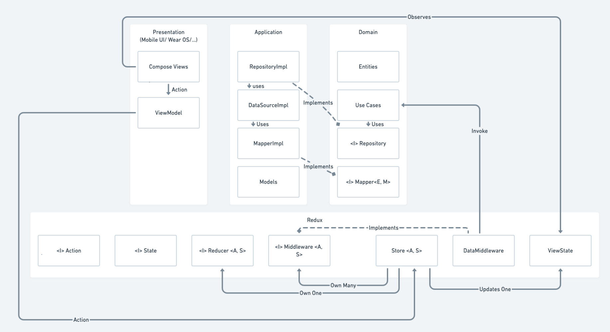

<h2 align="center">CryptoCurrency_CleanArchitecture</h3>

---

  Cryptocurrency android app using Jetpack Compose, MVVM/MVI and the Clean Architecture for educational purpose.

## ⛏️ Built Using

- [Hilt/Dagger2](https://dagger.dev/hilt/) - Dependency Injection
- [Retrofit](https://square.github.io/retrofit/) - Networking
- [Jetpack Compose](https://developer.android.com/jetpack/compose) - UI
- [Kotlin Flow](https://kotlinlang.org/docs/flow.html) - Reactive Programming

## 🔧 About Clean Architecture

The Clean Architecture, as many others, defines layers (which are separated in modules here) where the dependency between those layers should always go inward, the grouped layers are indeed represented as an onion (Onion Architecture) where the center of the onion should never be aware of the outwards layers, making it totally decoupled from those layers.

To know more about the Clean Architecture and the benefits of using it : <a href="https://blog.cleancoder.com/uncle-bob/2012/08/13/the-clean-architecture.html">The Clean Code Blog</a>

## 🔧 Combined with MVVM
 

### Domain

My implementation of the clean architecture assumes that there is three layers, the "Domain" where some interfaces are defined, entities are found and Use Cases are implemented, the domain is the center most layer, it is not aware of the other layers. The presentation or the application layers could change without it knowing it or needing to change.
Use Cases are defined actions requesting data or updating data from a data source.

### Application

Then there is the "Application" layer, it implements data sources and repositories, it uses the interfaces from the domain and it maps models from the data sources to the entities which will be used by the presentation layer. It is aware of which database or networking library our application is using if any.

### Presentation

Finally we have the "Presentation" layer which will be dependent on the UI framework our application is using, in our case it is dependent on the Android framework. 
I used the MVVM architecture, my ViewModel contains a State that is observed by the view which will be recomposed when the State changes. And the State changes when we interact with the Use Cases.

## 🔧 Combined with MVI
 

### Introduction

MVI (Model-View-Intent) takes a redux-like approach where a given action outputs a defined state, the state is the single source of truth, it is immutable and is defined only by the reducer.
This whole process of reducing an action to a state makes the whole system predictable, easily testable and straightforwardly debuggable.

### Explanation

The "intent" part of MVI is a term used to define the action of the user or his "intent" to do something (clicking a button, loading an information...). This intent should output a state and this state should be observed by the view and be recomposed accordingly.
As seen in the MVVM implementation, we already have a state inside the ViewModel and this should not change, only the source of the state will change, the MVI is often coupled with a ViewModel or a Presenter.

### Store

The store will be in charge of dispatching the action to the reducer but also to the defined middlewares.

## ⏱️ Current State

At the current time, you will find in the project the two architectures MVI with MVVM (coin list) and MVVM alone (coin detail), that is intended to show that MVI may be used in some part of the application where it is most needed, like a screen with a lot of actions, and be left in other parts.

I created two tags, 'simple_mvvm' and 'mvi_mvvm', the latter is the current state of the project, the former is the project with MVVM only, it also shows that it can be possible to switch from a simple MVVM implementation to an MVI/MVVM at any moment.

## 📝 Conclusion

The project is not totally finished, I will maybe add things later on (like caching) or change things as I realize that some parts could be handled in a better way, but I am happy with it's current state and with my current understanding of the whole architecture as it was only intended to be an educational project.

As of my thoughts on this architecture, as many others before me, I think that it is not a solution for every application, it may be too complicated for some cases and it will not bring much for the time spent on building it, otherwise for complex applications I think that it may resolve different issues that will make the application more robust and make the development easier later on.  
As always, architecture is mainly the solution to some given problems, and should be examined case by case.

## 🙏 Credits

<a href="https://www.youtube.com/watch?v=EF33KmyprEQ">https://www.youtube.com/watch?v=EF33KmyprEQ</a> by <i>Philipp Lackner</i>
 
For the idea behind the project and the UI

<a href="https://www.youtube.com/watch?v=wTJX_lWdh60">https://www.youtube.com/watch?v=wTJX_lWdh60</a> by <i>Adam McNeilly</i>